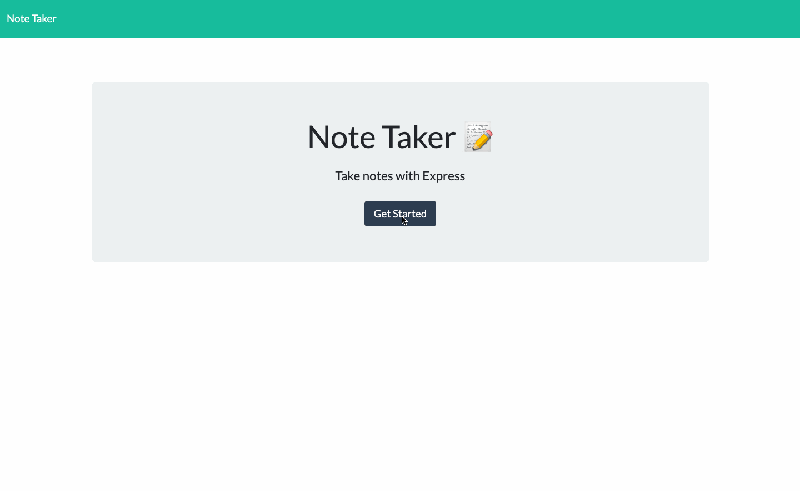

# note-taking-app

This app is a modification of starter code given by the UNC Bootcamp. It creates a note taking application called that can be used to write new notes, save them, and delete them. This app will uses Express.js back-end and saves and retrieves note data from a JSON file.

Like to deployed Application (Heroku):

[Note Taking App](https://note-taker-cp.herokuapp.com/)

## Questions
celparros@gmail.com